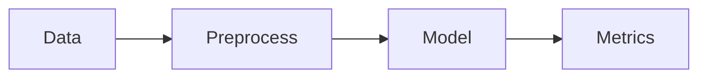

# Chapter X — Title

!!! tip "Key takeaway"
    Keep this section short—what should they remember?

=== "Student"
    - Theory bullets
    - Small derivation or plot
    - Link to slides (HTML/PDF)

=== "SME"
    - Practical checklist (data → model → metrics → iterate)
    - Example with business framing

## Code Snippet

```python
# short snippet; full demo in notebook
from sklearn.model_selection import train_test_split
...
```

## Notebook
- Rendered notebook: {{ inline if using mkdocs-jupyter }}
- Download: `[notebooks/chX-demo.ipynb](../assets/notebooks/chX-demo.ipynb)`

## Diagrams


## Common Pitfalls
- ...
- ...

## References
- Book chapter link / paper / docs
